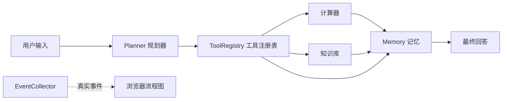

# 从零理解 Agent：原理、代码与可视化

## 1. Agent 是什么？

Agent 是“会根据目标选择下一步动作的程序”。普通程序一般是固定流程：输入 A，按写死步骤得到 B。Agent 多了决策层：先理解任务，再选择工具，根据结果组织回答。

本项目是教学版 Agent。它用中文规则替代大模型，因此每一步都透明、可预测；未来只需替换规划器就能接入大模型。

## 2. Agent 的基本闭环

    用户任务 → 感知 → 规划 → 行动（工具） → 观察结果 → 记忆 → 最终回答

五个关键词是：感知、规划、行动、观察、记忆。项目中的“观察”发生在 Agent 收到 ToolResult 时；无论成功还是失败，都会变成可读回答。

## 3. 架构与一次运行

输入“计算 (12 + 3) * 2”时：

| 步骤 | 连线 | 变量 | 意义 |
| --- | --- | --- | --- |
| 1 | 用户输入 → 规划器 | task | 原始任务 |
| 2 | 规划器 → 工具注册表 | plan、tool_name | 选择计算器 |
| 3 | 工具注册表 → 计算器 | tool_input | 表达式 |
| 4 | 计算器 → 记忆 | tool_result | 结果 30 |
| 5 | 记忆 → 最终回答 | answer | 计算结果：30 |

网页里蓝色边框和“▶ 正在运行”表示当前模块；橙色光点表示一次真实的数据传递。光点旁的变量由程序事件提供，不是固定演示文字。

## 4. 每个模块的职责

### events.py：运行事件

RunEvent 记录来源、目标、变量和步骤编号；EventCollector 按顺序收集它们。summarize 会把超过 80 字符的变量截断，避免遮挡流程图。核心业务通过“产生事件”而不是直接控制界面，这让终端版和网页能复用同一个 Agent。

### planner.py：规划器

Planner.create_plan(task) 返回 Plan，其中包括 intent、tool_name、tool_input 和 description。它识别三类任务：以“计算 ”开头的计算任务；含“什么是”或 agent 的知识任务；其余为普通对话。规划只做决策，不做计算。

### tools.py：工具和安全边界

ToolResult 有 ok 和 content 两部分。ToolRegistry 是工具箱，Agent 通过名称请求工具。

计算器先用 ast.parse 把文本变成抽象语法树，只允许数字、括号和基本运算节点。函数调用、变量名和导入都不在白名单，因此像 __import__('os') 这样的输入会被拒绝。重要原则：用户或模型说“执行”，不代表程序应无条件执行。

### memory.py：短期记忆

Memory 把本轮用户任务和 Agent 回答保存为 role 与 content 字典。它是内存记忆，程序停止即消失。以后可改成 JSON、数据库或向量数据库，但先明确“保存什么”比先接数据库更重要。

### agent.py：总指挥

Agent.run(task) 依次：创建事件收集器；调用规划器；按计划调用工具；把工具结果组织成回答；保存记忆；返回回答和事件列表。它不负责具体计算，也不负责关键词判断，这种编排边界方便以后替换模块。

### web_server.py 和 static：可视化

网页把任务提交给 POST /api/run。服务端运行真实的 Agent().run(task)，并返回 answer 和 events。app.js 的 showEvent(index) 高亮目标模块、让光点移动到来源—目标连线，并把 variables 放在光点旁；自动播放每 900 毫秒推进一步，暂停、上一步、下一步和重置都只是在控制事件索引。

## 5. 扩展练习

1. 在 knowledge_base 中增加“什么是记忆？”的解释。
2. 新增“字数”工具：写 text_length；在 ToolRegistry 注册；在 Planner 识别“字数 ”前缀；在 TOOL_LABELS 与网页 SVG 增加模块和连线；先写测试。
3. 让 Memory.recent() 在普通对话回答中显示上一轮任务。

## 6. 升级为大模型 Agent

未来只要替换 Planner：把任务和可用工具清单发送给大模型，让它返回 intent、tool_name、tool_input 和 description 的 JSON。收到 JSON 后必须验证工具名和参数，仍然只能经 ToolRegistry 调用。这样 Agent、Memory、事件和可视化页面几乎不用改变。

## 7. 自测

1. 为什么不能直接计算用户输入？答：输入可能含函数调用或危险代码，所以必须使用 AST 白名单。
2. 为什么 Agent 不直接调用计算函数？答：注册表统一管理工具和未知工具错误，便于扩展。
3. 页面变量来自哪里？答：EventCollector 收集的真实 RunEvent.variables，经本地 API 返回。
4. 最少替换哪个模块可接入大模型？答：Planner，同时必须验证模型输出。

掌握本项目后，你已拥有 Agent 的核心骨架。下一步可学习长期记忆、RAG、多轮规划和多 Agent 协作。
